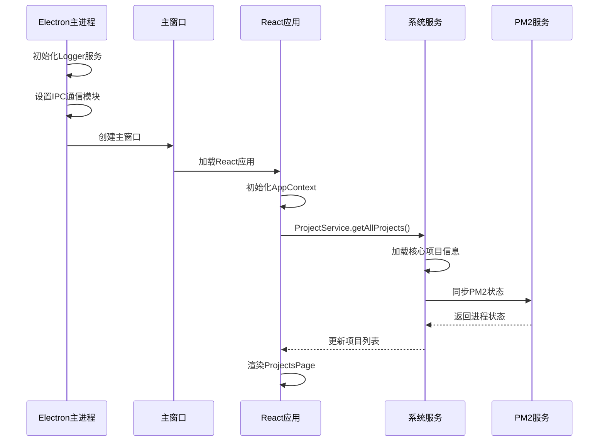
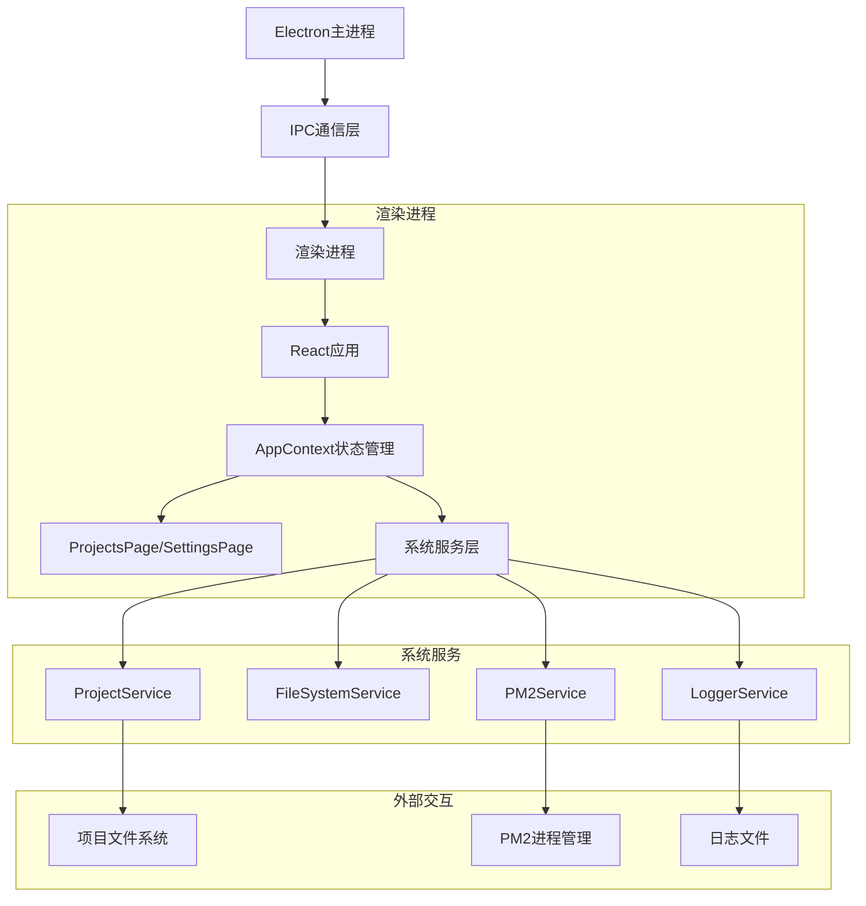
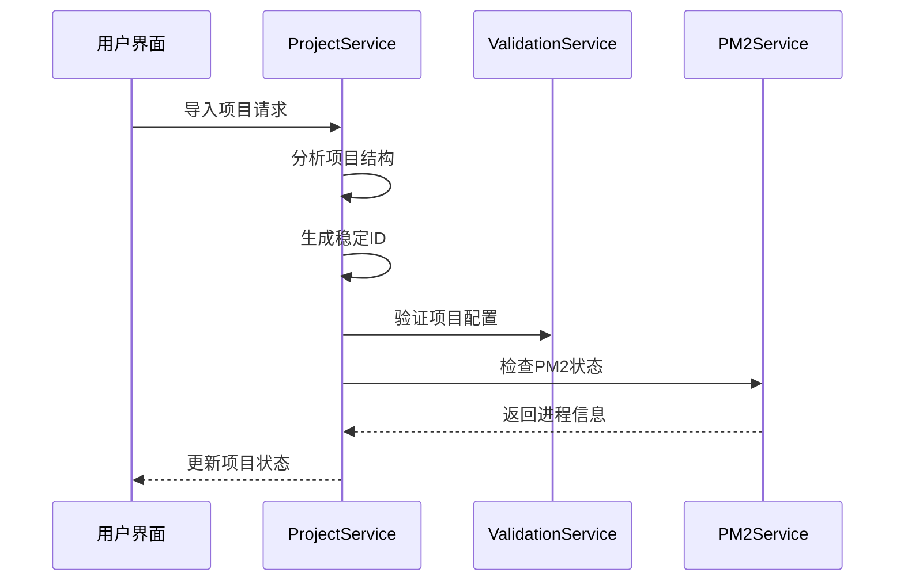
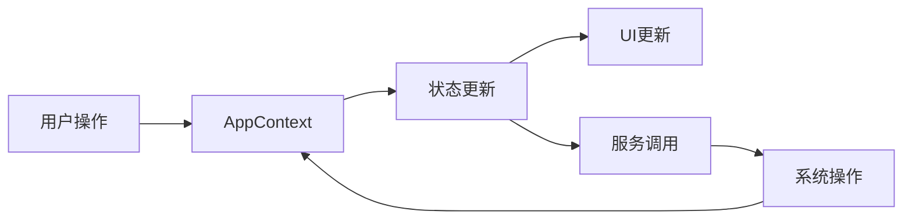
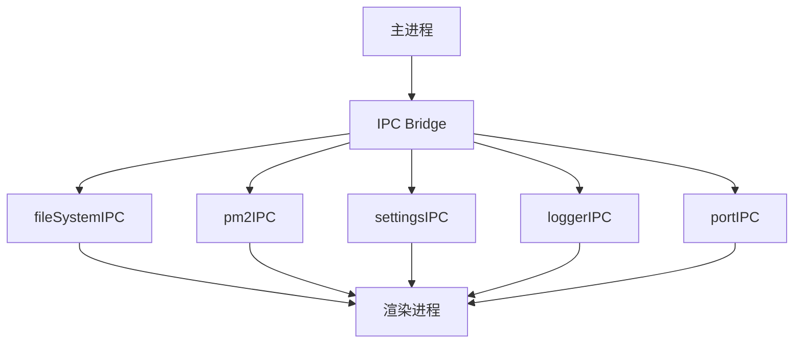
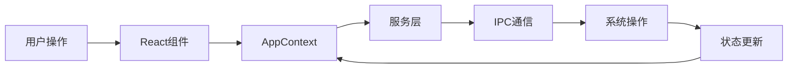
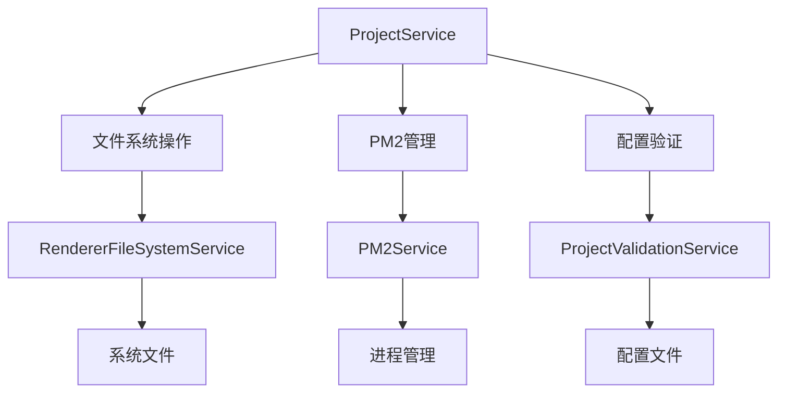
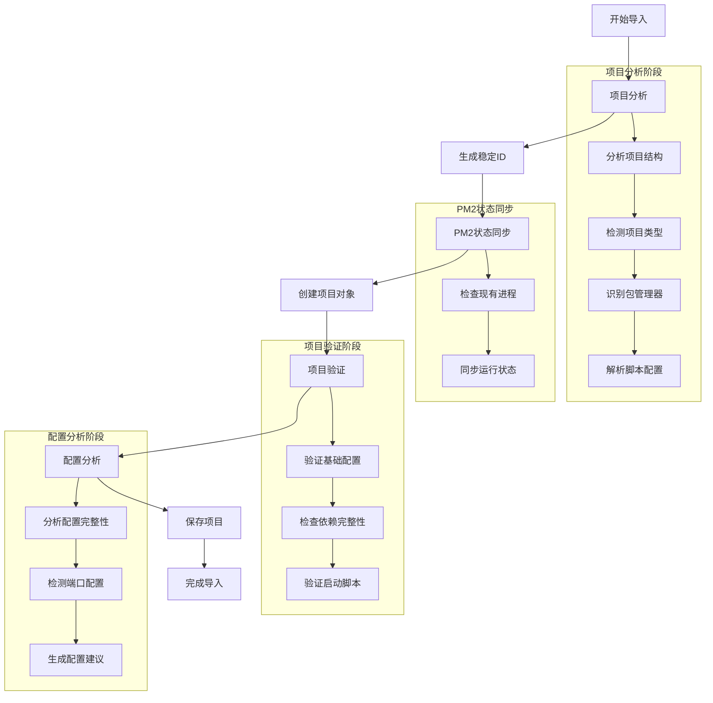
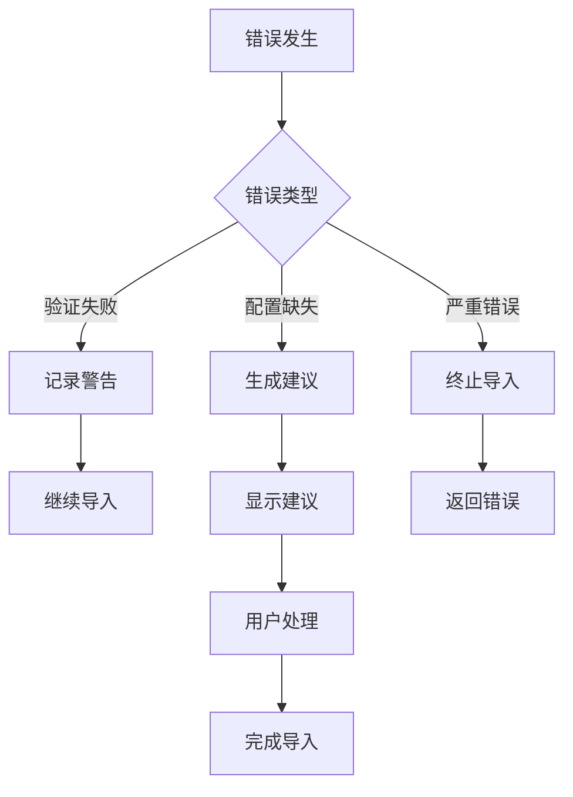
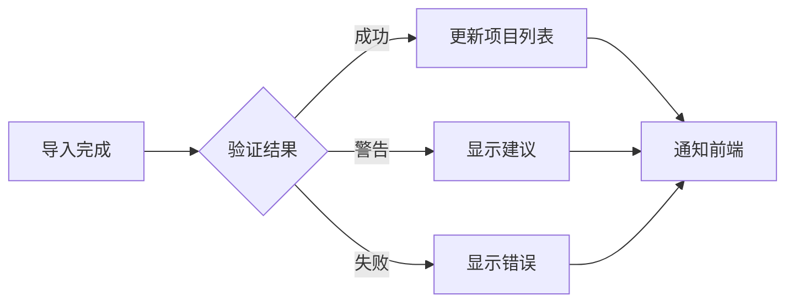

# NodeAppManager 启动系统架构说明

## 📋 层次结构

### 🌍 第一层: 全局启动器 (`nam` 命令)
**文件**: `/usr/local/bin/nam` (全局可执行)
**作用**: 
- 🎯 解决路径问题
- 📍 自动切换到项目目录
- 🚀 提供全局访问

**调用方式**:
```bash
# 从任何位置都可以运行
nam start    # 启动应用
nam restart  # 重启应用
nam stop     # 停止应用
nam status   # 查看状态
```

### 🧠 第二层: 智能启动器 (`smart-start.sh`)
**文件**: `NodeAppManager/smart-start.sh`
**作用**:
- 🔍 环境检查和验证
- 🛡️ 错误处理和恢复
- 🔄 进程管理 (启动/停止/重启)
- 📊 状态监控和报告

**调用关系**:
```bash
# smart-start.sh 会间接调用 start-dev.sh
./smart-start.sh start
    ↓
./start-dev.sh
```

### 🚀 第三层: 核心启动脚本 (`start-dev.sh`)
**文件**: `NodeAppManager/start-dev.sh`
**作用**:
- ⚡ 实际的应用启动逻辑
- 🔧 依赖安装和编译
- 📊 日志监控集成
- 🌐 Vite + Electron 服务启动

## 🔗 完整调用链

```
用户输入: nam start
    ↓ (全局命令)
/usr/local/bin/nam
    ↓ (切换目录并调用)
cd /Users/vidar/works/NodeAppManager/NodeAppManager
    ↓ (执行智能启动器)
./smart-start.sh start
    ↓ (环境检查后调用)
./start-dev.sh
    ↓ (启动服务)
Vite + Electron 应用运行
```

## ✅ 优势分析

### 🎯 **保持原有功能**
- `start-dev.sh` 完全保持不变
- 所有现有的启动逻辑都保留
- 日志监控功能继续有效

### 🧠 **增强智能性**
- 自动路径处理
- 环境验证
- 错误恢复
- 进程管理

### 🌍 **全局可用性**
- 从任何目录都能启动
- 统一的命令接口
- 不需要记忆路径

### 🛡️ **向后兼容**
```bash
# 原来的方式依然有效
cd /Users/vidar/works/NodeAppManager/NodeAppManager
./start-dev.sh

# 智能启动器也可以直接用
./smart-start.sh start

# 新的全局方式
nam start
```

## 🔧 实际使用场景

### 场景1: 你在任何目录下
```bash
# 不需要记忆路径
nam start
```

### 场景2: 应用崩溃需要重启
```bash
nam restart
```

### 场景3: 检查应用状态
```bash
nam status
```

### 场景4: 停止应用
```bash
nam stop
```

## 📊 文件依赖关系

```
nam (全局)
├── smart-start.sh (智能层)
│   ├── start-dev.sh (核心层)
│   │   ├── package.json
│   │   ├── tsconfig.json
│   │   └── vite.config.ts
│   ├── auto-log-monitor.sh
│   └── view-logs.sh
└── 项目目录检查
```

## 💡 总结

**是的，`start-dev.sh` 依然非常重要！**

1. **核心地位**: 它是实际启动应用的核心脚本
2. **功能完整**: 保留所有原有功能，包括日志监控
3. **间接调用**: 通过智能启动器间接调用，增加了智能功能
4. **向后兼容**: 原来的调用方式依然有效

这种设计让你：
- 🎯 从任何地方都能启动应用 (`nam start`)
- 🔄 不会忘记使用正确的路径
- 🛡️ 获得额外的智能功能
- ✅ 保持所有原有功能不变

## 📊 应用启动流程



## 🔄 系统运行时流程



## 🔍 核心功能流程

### 1. 项目导入流程


### 2. 状态管理流程


## 🔌 系统通信架构

### IPC通信模块


## 📦 数据流转图



## 🛠 关键服务交互



## 📥 项目导入执行逻辑

### 1. 导入流程概览



### 2. 详细执行步骤

#### 2.1 项目分析阶段
- **输入验证**
  - 验证项目路径是否存在
  - 检查基本目录结构

- **项目信息提取**
  ```typescript
  const projectAnalysis = await this.analyzeProject(projectPath);
  // 提取信息：
  // - 项目名称
  // - 项目类型
  // - 包管理器
  // - 可用脚本
  ```

#### 2.2 稳定ID生成
- **算法流程**
  ```typescript
  const stableId = PM2Service.generateStableProjectId(name, path);
  // 1. 组合项目名称和路径
  // 2. 生成唯一哈希
  // 3. 确保ID稳定性和唯一性
  ```

#### 2.3 PM2状态同步
- **执行步骤**
  ```typescript
  const pm2SyncResult = await PM2Service.checkAndSyncPM2Status(name, path);
  // 检查项目是否:
  // 1. 已在PM2中注册
  // 2. 当前运行状态
  // 3. 最后执行时间
  ```

#### 2.4 项目对象创建
- **对象结构**
  ```typescript
  const newProject = {
    id: stableId,
    name: projectAnalysis.name,
    path: projectPath,
    status: pm2SyncResult.status,
    type: projectAnalysis.type,
    packageManager: projectAnalysis.packageManager,
    scripts: projectAnalysis.scripts,
    port: portInfo?.defaultPort
  };
  ```

#### 2.5 项目验证流程
- **验证项目**
  ```typescript
  const validationResult = await ProjectValidationService.validateProject(
    newProject,
    onProgress
  );
  // 验证内容：
  // 1. package.json 完整性
  // 2. 依赖项检查
  // 3. 启动脚本验证
  // 4. 配置文件检查
  ```

#### 2.6 配置分析
- **分析维度**
  ```typescript
  const configAnalysis = await ProjectConfigAnalysisService.analyzeProjectConfiguration(
    projectPath
  );
  // 分析内容：
  // 1. 配置完整性
  // 2. 端口配置
  // 3. 主文件位置
  // 4. 缺失配置项
  ```

### 3. 错误处理机制



### 4. 进度反馈机制

- **进度通知**
  ```typescript
  onProgress?.('当前执行步骤', 'info|warn|error|success');
  ```

- **状态级别**
  - `info`: 普通信息
  - `warn`: 警告信息
  - `error`: 错误信息
  - `success`: 成功信息

### 5. 导入结果处理



这个详细的执行逻辑说明展示了项目导入过程中的每个关键步骤，包括数据流转、错误处理、和状态管理。每个环节都经过精心设计，确保了导入过程的可靠性和用户体验。
